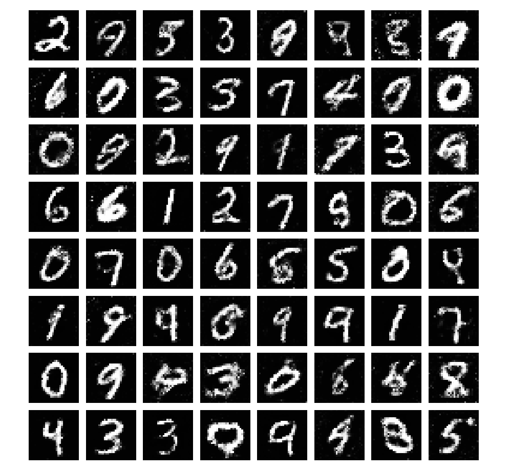
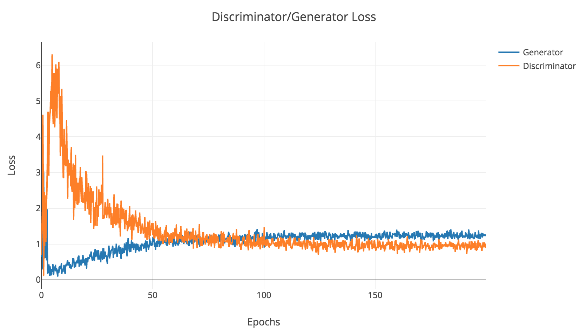

# GAN-Digits

# Installation
Assuming you have [pytorch](https://pytorch.org) installed :
```
git clone https://github.com/sharad1126/GAN-Digits
cd GAN-Digits
pip install -r requirements.txt
```

# Usage
```
python -m visdom-server
# and then in a separate tab
python train.py
```
then at `http://localhost:8097/` you should start seeing the plots.

# Results

## Generated Images


## Loss plots


# Author
Sharad Agarwal <sharad.agarwal@cern.ch>
